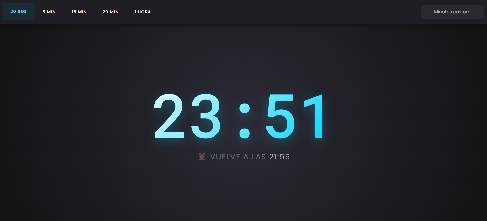

# Countdown - Reto JavaScript 30



En este reto se hizo el contador junto con los botones en javascript.

El código fundamental del ejercicio es:

```javascript
function timer(seconds) {
  clearInterval(countdown);

  const now = Date.now();
  const then = now + seconds * 1000;
  displayEndTime(then);
  displayTimeLeft(seconds);

  countdown = setInterval(() => {
    const secondsLeft = Math.round((then - Date.now()) / 1000);
    if (secondsLeft < 0) {
      clearInterval(countdown);
      return;
    }
    displayTimeLeft(secondsLeft);
  }, 1000);
}
```

Esta función es la encargada de poder gestionar de manera sencilla el registro y presentación del tiempo en los elementos html.

Utilizamos:

```javascript
document.querySelector("nombre-clase");
```

para poder acceder a los elementos y así cambiar los valores en la interfaz gráfica.
